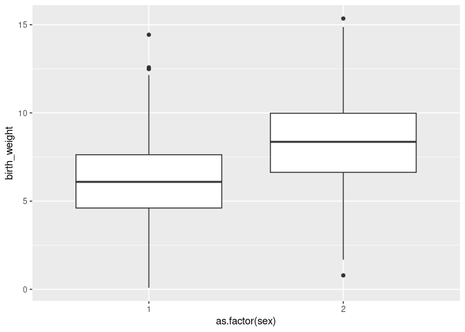
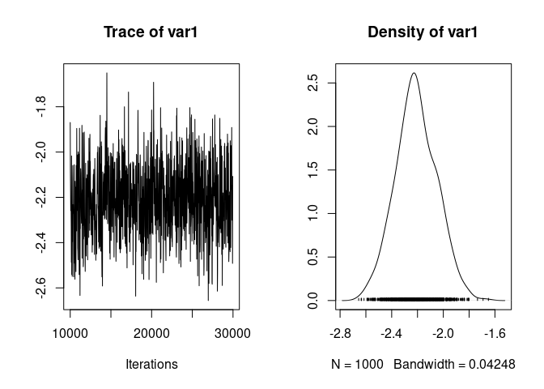
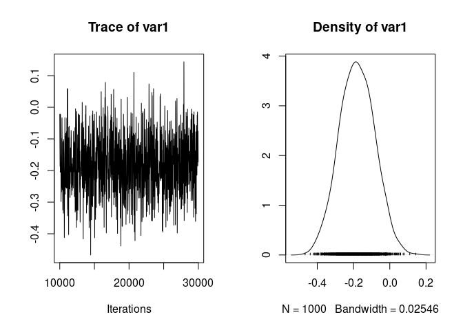
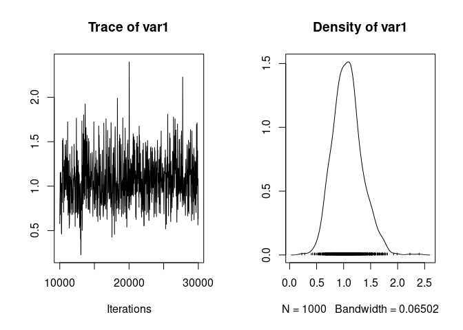

Here we will see how to add fixed effects and random effects to our linear animal model. We will also see how the addition of these effects can impact the calculation of heritability.

We still use the gryphon dataset with `birth_weight` as the response, and MCMCglmm.


```r
phenotypicdata <- read.csv("data/gryphon.csv")
pedigreedata <- read.csv("data/gryphonped.csv")
```


```r
library(MCMCglmm)
```


```r
inverseAmatrix <- inverseA(pedigree = pedigreedata)$Ainv
```


Previously we run the simple model `model1.2` (not run again here):


```r
model1.2 <- MCMCglmm(birth_weight ~ 1, #Response and Fixed effect formula
                   random = ~id, # Random effect formula
          ginverse = list(id = inverseAmatrix), # correlations among random effect levels
          data = phenotypicdata, # data set
          burnin = 10000, nitt = 30000, thin = 20) # run the model for longer compare to the default
```

## Adding fixed effects

We will start by adding sex as a fixed effect. Why? Because sexes appear to be quite different in term of birth weight and our `model1.2` does not capture those differences. A model that accounts for important structures in the response variables will fit the data better and will tend to provide empirical parameter estimates that are more accurate, precise and better correspond to the conceptual parameter of interest. The addition of any fixed effect must be motivated by the scientific question or the need to control structures in the data though, think about it carefully.

We can check that sexes are quite different in birth weight visually:


```r
library(ggplot2)
ggplot(phenotypicdata, aes(x=as.factor(sex), y=birth_weight)) + geom_boxplot()
```

```
## Warning: Removed 230 rows containing non-finite outside the scale range
## (`stat_boxplot()`).
```

<!-- -->

Sex is coded with values 1 and 2. It can be simpler to read model outputs if sex is coded with values 0 and 1, or with explicit labels. We will use `"M"` and `"F"` and store the new encoding as the column `sexMF`:


```r
phenotypicdata$sexMF <- ifelse(phenotypicdata$sex==1, "M", "F")
```

To add `sexMF` as a fixed effect to the model we add the column name in the line which contains the response variable, on the right-hand side of the tilde (`~`). Different fixed effects can be added using `+` signs. The `1` that was already there stands for the intercept. 


```r
model1.3 <- MCMCglmm(birth_weight ~ 1 + sexMF, #Response and Fixed effect formula
                   random = ~id,
          ginverse = list(id = inverseAmatrix), 
          data = phenotypicdata,
          burnin = 10000, nitt = 30000, thin = 20) 
```


```r
summary(model1.3)
```

```
## 
##  Iterations = 10001:29981
##  Thinning interval  = 20
##  Sample size  = 1000 
## 
##  DIC: 3714.216 
## 
##  G-structure:  ~id
## 
##    post.mean l-95% CI u-95% CI eff.samp
## id     3.102    2.226    4.202    447.9
## 
##  R-structure:  ~units
## 
##       post.mean l-95% CI u-95% CI eff.samp
## units     2.936    2.193    3.748    469.8
## 
##  Location effects: birth_weight ~ 1 + sexMF 
## 
##             post.mean l-95% CI u-95% CI eff.samp  pMCMC    
## (Intercept)     8.269    7.978    8.529   1000.0 <0.001 ***
## sexMFM         -2.211   -2.508   -1.891    921.4 <0.001 ***
## ---
## Signif. codes:  0 '***' 0.001 '**' 0.01 '*' 0.05 '.' 0.1 ' ' 1
```

The model summary shows a posterior mean difference of -2.211 of males compared to females. You know the difference is about males because the name of the parameter in the summary ends with "M". Females are therefore the reference in this model.

Fixed effects are stored in the `$Sol` element of MCMCglmm models.
We can visualise the trace and posterior distribution of the difference:


```r
plot(model1.3$Sol[,"sexMFM"])
```

<!-- -->

And we can compute the usual summary of the posterior distribution of the sex difference:


```r
median(model1.3$Sol[,"sexMFM"])
```

```
## [1] -2.219992
```

```r
posterior.mode(model1.3$Sol[,"sexMFM"])
```

```
##      var1 
## -2.242623
```

```r
HPDinterval(model1.3$Sol[,"sexMFM"])
```

```
##          lower     upper
## var1 -2.507572 -1.891486
## attr(,"Probability")
## [1] 0.95
```

### "Testing" fixed effects

We can also calculate posterior probabilities that are analogue to p-values using the proportion of posterior samples that are beyond a certain value.
Thus, the posterior probability that the difference is not negative is:


```r
mean( model1.3$Sol[,"sexMFM"] >= 0 )
```

```
## [1] 0
```

We will generally want to double that value to make it analogue to a two-sided p-value:


```r
2 * mean( model1.3$Sol[,"sexMFM"] >= 0 )
```

```
## [1] 0
```

Here there are no samples above zero, so twice the posterior probability is estimated to exactly 0. Since we had only 1000 samples we are actually unable to estimate a probability less that 0.001. That is why we will want to report a posterior probability $p_{MCMC}$ of `<0.001`. That is what is reported in the summary of the model.

Note that you can compute posterior probabilities testing the parameter estimate against arbitrary values. For instance, the  $p_{MCMC}$ that the sex difference is above $-2$ is:


```r
2 * mean( model1.3$Sol[,"sexMFM"] >= -2 )
```

```
## [1] 0.188
```

and the $p_{MCMC}$ that the sex difference is below $-2.5$ is:


```r
2 * mean( model1.3$Sol[,"sexMFM"] <= -2.5 )
```

```
## [1] 0.064
```

### Adding a continuous fixed effect

There are not many variables to experiment with in this dataset, but let's say we want to include cohort as a fixed effect, for instance because we want to account for a linear change in the response through time.

Let's just re-scale cohort to avoid changing the intercept and perhaps to help a bit the estimation algorithm (it is often easier to have fixed effects on similar scales) and interpretation (it may be easier to see what is a big or small effect when fixed effects are standardized, although it is by no mean necessary).


```r
model1.4 <- MCMCglmm(birth_weight ~ 1 + sexMF + scale(cohort), #Response and Fixed effect formula
                   random = ~id, 
          ginverse = list(id = inverseAmatrix),
          data = phenotypicdata,
          burnin = 10000, nitt = 30000, thin = 20) 
```


```r
summary(model1.4)
```

```
## 
##  Iterations = 10001:29981
##  Thinning interval  = 20
##  Sample size  = 1000 
## 
##  DIC: 3711.059 
## 
##  G-structure:  ~id
## 
##    post.mean l-95% CI u-95% CI eff.samp
## id     3.101    2.068    4.004    347.7
## 
##  R-structure:  ~units
## 
##       post.mean l-95% CI u-95% CI eff.samp
## units     2.912    2.146    3.701    427.4
## 
##  Location effects: birth_weight ~ 1 + sexMF + scale(cohort) 
## 
##               post.mean  l-95% CI  u-95% CI eff.samp  pMCMC    
## (Intercept)    8.284178  8.034420  8.564222     1125 <0.001 ***
## sexMFM        -2.226082 -2.540083 -1.928606     1000 <0.001 ***
## scale(cohort) -0.180259 -0.360857  0.005216     1000  0.052 .  
## ---
## Signif. codes:  0 '***' 0.001 '**' 0.01 '*' 0.05 '.' 0.1 ' ' 1
```

As previously we can plot the trace and posterior distribution of the effect of cohort, compute its posterior mean, median, mode, credible interval, and $p_{MCMC}$


```r
plot(model1.4$Sol[,"scale(cohort)"])
```

<!-- -->


```r
mean(model1.4$Sol[,"scale(cohort)"])
```

```
## [1] -0.1802587
```

```r
median(model1.4$Sol[,"scale(cohort)"])
```

```
## [1] -0.1803727
```

```r
posterior.mode(model1.4$Sol[,"scale(cohort)"])
```

```
##       var1 
## -0.1720475
```

```r
HPDinterval(model1.4$Sol[,"scale(cohort)"])
```

```
##           lower       upper
## var1 -0.3608569 0.005216475
## attr(,"Probability")
## [1] 0.95
```

```r
2*mean(model1.4$Sol[,"scale(cohort)"]>0)
```

```
## [1] 0.052
```


## Adding random effects

We will often want to include random effects in addition to the additive genetic variance random effect. In particular it is an important way to control for non-genetic sources of similarity between relatives which may inflate the estimates of additive genetic variance and heritability.

For instance, it is very common to include the mother identity as a random effect, as individuals born from the same mother may share an environment in early life (e.g., nest or food provisioning).

To include mother as a random effect we write the variable name in the argument `random`, after `ìd +`. We do not need to change the argument `ginverse` if we assume that the levels of the additional random effect are uncorrelated (this is often not strictly true, and it can be interesting to model the genetic correlations between maternal levels, but this is a more advanced topic.)


```r
model1.5 <- MCMCglmm(birth_weight ~ 1 + sexMF + scale(cohort), 
                   random = ~id + mother, # Random effect formula
          ginverse = list(id = inverseAmatrix),
          data = phenotypicdata, 
          burnin = 10000, nitt = 30000, thin = 20) 
```


```r
summary(model1.5)
```

```
## 
##  Iterations = 10001:29981
##  Thinning interval  = 20
##  Sample size  = 1000 
## 
##  DIC: 3568.019 
## 
##  G-structure:  ~id
## 
##    post.mean l-95% CI u-95% CI eff.samp
## id     2.671    1.594    3.921    189.5
## 
##                ~mother
## 
##        post.mean l-95% CI u-95% CI eff.samp
## mother     1.071   0.5586    1.589    563.9
## 
##  R-structure:  ~units
## 
##       post.mean l-95% CI u-95% CI eff.samp
## units     2.306    1.375    3.174    201.3
## 
##  Location effects: birth_weight ~ 1 + sexMF + scale(cohort) 
## 
##               post.mean  l-95% CI  u-95% CI eff.samp  pMCMC    
## (Intercept)    8.319287  8.034262  8.582700     1000 <0.001 ***
## sexMFM        -2.233155 -2.542082 -1.917310     1000 <0.001 ***
## scale(cohort) -0.181168 -0.375359 -0.004372     1000   0.05 *  
## ---
## Signif. codes:  0 '***' 0.001 '**' 0.01 '*' 0.05 '.' 0.1 ' ' 1
```

Posterior distributions of random effect variance parameters are stored in the `$VCV` element of MCMCglmm models.

We can visualise the trace and posterior distribution of the variance associated with mother identity as:


```r
plot(model1.5$VCV[,"mother"])
```

<!-- -->

And we can compute summaries of the posterior distribution:


```r
mean(model1.5$VCV[,"mother"])
```

```
## [1] 1.071025
```

```r
median(model1.5$VCV[,"mother"])
```

```
## [1] 1.059679
```

```r
posterior.mode(model1.5$VCV[,"mother"])
```

```
##     var1 
## 0.981803
```

```r
HPDinterval(model1.5$VCV[,"mother"])
```

```
##          lower    upper
## var1 0.5586244 1.589435
## attr(,"Probability")
## [1] 0.95
```

Note that it is not really meaningful to compute $p_MCMC$ to test a variance in greater than zero, as the parameter is constrained to be greater than zero, and the probability will always be 1.
It is possible to compute $p_MCMC$ for other values though, for instance, we can estimate the probability that the variance associated with mother identity is greater than 1.5:


```r
2*mean(model1.5$VCV[,"mother"] >= 1.5 )
```

```
## [1] 0.14
```

or we can estimate if the variance associated with mother identity is less than the additive genetic variance:


```r
2*mean(model1.5$VCV[,"mother"] > model1.5$VCV[,"id"] )
```

```
## [1] 0.022
```

(here the additive genetic variance is almost certainly greater than the mother variance.)


We can add a third random effect, for instance cohort (yes, we can include cohort both as fixed and random effect):


```r
model1.6 <- MCMCglmm(birth_weight ~ 1 + sexMF + scale(cohort), 
                   random = ~id + mother + cohort, # Random effect formula
          ginverse = list(id = inverseAmatrix),
          data = phenotypicdata, 
          burnin = 10000, nitt = 30000, thin = 20) 
```


## Computing heritability without accounting for fixed effects

We could compute heritability as the ratio of additive genetic variance over the sum of random effect and residual variance. In the case of model1.6 that would be $h^2 = V_A / (V_A + V_M + V_C + V_R) $


```r
h2_nofixef <- model1.6$VCV[,"id"] / (model1.6$VCV[,"id"] + model1.6$VCV[,"mother"] + model1.6$VCV[,"cohort"] + model1.6$VCV[,"units"])
```


```r
median(h2_nofixef)
```

```
## [1] 0.386974
```

```r
HPDinterval(h2_nofixef)
```

```
##          lower     upper
## var1 0.2455021 0.5369925
## attr(,"Probability")
## [1] 0.95
```

Note that the estimate of heritability is a bit less than what we estimated from model1.2. This is likely because the random effect `mother` corrects for some similarity between siblings that was conflated with additive genetic variance in the that did not account for mother identity.

However, this calculation of heritability may not be satisfactory as it leaves out some variance that is accounted in the fixed effects.

## Computing heritability while accounting for fixed effects

Often we will want to include the variance accounted in the fixed effect back into the computation of heritability. But this is a complex issue and depending on data and scientific questions it may be best to either exclude fixed effects, include all fixed effects, or include some fixed effects but not others. It may even be useful to exclude some random effects (for instance if a random effect structurally captures measurement error.)

The variance due to fixed effect can be computed as the variance in model predictions (without accounting for random effects). 
Those predictions can be computed as the matrix product of predictors by parameter estimates.
In MCMCglmm it can be done like this:


```r
predictions1.6 <- model1.6$X %*% t(model1.6$Sol)
```

This object contains one row for each data point and one column for each posterior sample.


```r
dim(predictions1.6)
```

```
## [1] 1084 1000
```

For each posterior sample we can compute the variance:


```r
fixef_variance <- apply(predictions1.6, MARGIN = 2, var)
```

We can then plug it in the calculation of heritability:


```r
h2_fixef <- model1.6$VCV[,"id"] / (model1.6$VCV[,"id"] + model1.6$VCV[,"mother"] + model1.6$VCV[,"cohort"] + model1.6$VCV[,"units"] + fixef_variance)
```


```r
median(h2_fixef)
```

```
## [1] 0.3300817
```


