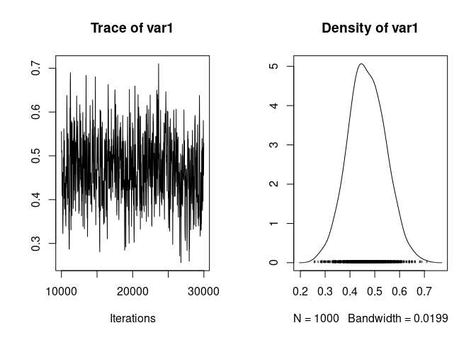

> If you have missed the page to fit a simple univariate model in MCMCglmm, click [here](/docs/univariate/mcmcglmm/) (Yes, you were supposed to click on MCMCglmm in the menu on the left to get to the first page)

Here we show how to compute narrow-sense heritability from a simple linear animal model.
Narrow-sense heritability, or heritability for short, can be defined as the ratio of additive genetic variance over phenotypic variance. In our case, we have modelled only the mean, the additive genetic variance and the residual variance, so heritability  is:
$ h^2 = V_A / V_P = V_A / (V_A + V_R)$.

We still use the gryphon dataset with `birth_weight` as the response, and MCMCglmm.


```r
phenotypicdata <- read.csv("data/gryphon.csv")
pedigreedata <- read.csv("data/gryphonped.csv")
```


```r
library(MCMCglmm)
```


```r
inverseAmatrix <- inverseA(pedigree = pedigreedata)$Ainv
```

We re-run the model we used previously:


```r
model1.2 <- MCMCglmm(birth_weight ~ 1, #Response and Fixed effect formula
                   random = ~id, # Random effect formula
          ginverse = list(id = inverseAmatrix), # correlations among random effect levels (here breeding values)
          data = phenotypicdata, # data set
          burnin = 10000, nitt = 30000, thin = 20) # run the model for longer compare to the default
```


```r
summary(model1.2)
```

```
## 
##  Iterations = 10001:29981
##  Thinning interval  = 20
##  Sample size  = 1000 
## 
##  DIC: 3912.137 
## 
##  G-structure:  ~id
## 
##    post.mean l-95% CI u-95% CI eff.samp
## id     3.406    2.227    4.668    379.1
## 
##  R-structure:  ~units
## 
##       post.mean l-95% CI u-95% CI eff.samp
## units     3.851    2.886     4.91    444.5
## 
##  Location effects: birth_weight ~ 1 
## 
##             post.mean l-95% CI u-95% CI eff.samp  pMCMC    
## (Intercept)     7.591    7.323    7.878    888.6 <0.001 ***
## ---
## Signif. codes:  0 '***' 0.001 '**' 0.01 '*' 0.05 '.' 0.1 ' ' 1
```

One could get a rough calculation of heritability using the values in the summary, but it is much better to apply (i.e., integrate) the calculation on the full posterior distribution. It is actually quite simple in MCMCglmm and in general an advantage of Bayesian approaches.

We extract the vector of additive genetic variance posterior values (there are 1000 of them), stored in `$VCV[,"id"]` and the vector of residual variance posterior values (also 1000 of them), stored in `$VCV[,"units"]` and compute the 1000 posterior values of heritabilities as:


```r
h2_full_posterior <- model1.2$VCV[, "id"] / (model1.2$VCV[, "id"] + model1.2$VCV[, "units"])
```

We can then look at the trace and distribution of heritability:


```r
plot(h2_full_posterior)
```

<!-- -->

at point estimates:


```r
mean(h2_full_posterior)
```

```
## [1] 0.4681129
```

```r
median(h2_full_posterior)
```

```
## [1] 0.4645503
```

```r
posterior.mode(h2_full_posterior)
```

```
##      var1 
## 0.4945104
```

and at credible intervals:


```r
HPDinterval(h2_full_posterior) # default 95% interval
```

```
##          lower     upper
## var1 0.3280573 0.6111057
## attr(,"Probability")
## [1] 0.95
```

```r
HPDinterval(h2_full_posterior, prob = 0.98) # another arbitrary interval with 98% probability
```

```
##          lower     upper
## var1 0.3002681 0.6515323
## attr(,"Probability")
## [1] 0.98
```
