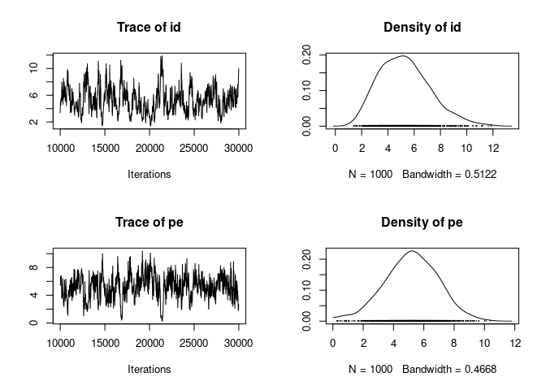

{}
Whenever a dataset contains repeated measurements of a trait for a same individual it is crucial to model **"permanent environments"**. Permanent environments are hypothetical non-genetic effects that have a long-lasting influence on phenotypic variation. If not accounted for, repeated measurements tend to inflate estimates of additive genetic variance and heritability. As a reward of modelling permanent environments you get to estimate **repeatability**.
{}

{}
To model repeated measurements we switch to a new dataset, `gryphonRepeatedMeas.csv`. We will model `laydate`, which is observed once a year in females when they breed. We want to estimate the heritability and, this time, the **repeatability** of `laydate`. The pedigree is the same we have used before. 
{}


``` r
library(MCMCglmm)
```


``` r
repeatedphenotypicdata <- read.csv("data/gryphonRepeatedMeas.csv")
pedigreedata <- read.csv("data/gryphonped.csv")
```


``` r
inverseAmatrix <- inverseA(pedigree = pedigreedata)$Ainv
```


The key to repeated measurement animal models is having a duplicate of the individual identity in the dataset. This allows to fit for each individual a breeding value, that is connected to the relatedness matrix, and a permanent environment value that is not. 
Let's keep `id` as the additive genetic random effect and call the duplicate `pe` (for permanent environment).


``` r
repeatedphenotypicdata$pe <- repeatedphenotypicdata$id
```

We will fit a random effect for `id`, one for `pe` and one for `cohort`, so the `G` element of the prior will have three elements:


``` r
prior_model_repeat_1 <- list(G = list(G1 =  list(V = 1, nu = 0.002),
                                     G2 =  list(V = 1, nu = 0.002),
                                     G3 =  list(V = 1, nu = 0.002)),
                            R =  list(V = 1, nu = 0.002))
```


``` r
model_repeat_1 <- MCMCglmm(lay_date ~ 1 + age, 
                           random = ~ id + pe + cohort, 
                           data = repeatedphenotypicdata,
                           ginverse = list(id=inverseAmatrix), 
                           prior = prior_model_repeat_1, 
                           burnin = 10000, nitt = 30000, thin = 20)
```

The mixing is okay but not great, and the `id` and `pe` chains appear to be a bit in mirror image.


``` r
plot(model_repeat_1$VCV[,c("id", "pe")])
```

<!-- -->

 That is usual in these models as it is difficult to disentangle the two effects that are linked to the same individual identity. 
 We can see that the two posterior distributions are negatively correlated:


``` r
plot(as.matrix(model_repeat_1$VCV[,c("id", "pe")]))
```

<!-- -->

It could be a good idea to rerun the model with parameter-expanded priors and / or with more iterations to get a bit more precision on credible intervals.

Assuming we are happy with the model fit, we can compute heritability as:


``` r
heritability1 <- model_repeat_1$VCV[,"id"] / rowSums(model_repeat_1$VCV)

median(heritability1); HPDinterval(heritability1)
```

```
## [1] 0.1674188
```

```
##           lower     upper
## var1 0.06635602 0.2886643
## attr(,"Probability")
## [1] 0.95
```

and repeatability as:


``` r
repeatability1 <- (model_repeat_1$VCV[,"id"] + model_repeat_1$VCV[,"pe"]) / 
                                                rowSums(model_repeat_1$VCV)

median(repeatability1); HPDinterval(repeatability1)
```

```
## [1] 0.3387718
```

```
##          lower     upper
## var1 0.2781737 0.3955035
## attr(,"Probability")
## [1] 0.95
```

If we want to take into account the variation due to age, the calculations become:


``` r
predictions <- model_repeat_1$X %*% t(model_repeat_1$Sol)
fixef_variance <- apply(predictions, MARGIN = 2, var)

heritability2 <- model_repeat_1$VCV[,"id"] / (rowSums(model_repeat_1$VCV) + fixef_variance)

median(heritability2); HPDinterval(heritability2)
```

```
## [1] 0.1578724
```

```
##           lower     upper
## var1 0.06463513 0.2743074
## attr(,"Probability")
## [1] 0.95
```

and


``` r
repeatability2 <- (model_repeat_1$VCV[,"id"] + model_repeat_1$VCV[,"pe"]) /
                            (rowSums(model_repeat_1$VCV) + fixef_variance )

median(repeatability2); HPDinterval(repeatability2)
```

```
## [1] 0.3190819
```

```
##          lower     upper
## var1 0.2636708 0.3759841
## attr(,"Probability")
## [1] 0.95
```


{}

The model we fitted can be written as
$$
y_{i,t} = \mu + \boldsymbol{X\beta} + a_i + r_i + \epsilon_{i,t}
$$
with $y_{i,t}$ the `laydate` of individual $i$ on year $t$, $\mu$ the intercept, $\boldsymbol{X\beta}$ fixed effects, $a_i$ individual $i$ breeding value, $r_i$ individual $i$ permanent environment or non-additive-genetic repeatable value and $\epsilon_{i,t}$ the residual. 
The model assumes $a_i$, $r_i$, and $\epsilon_{i,t}$ are drawn from Gaussian distribution of variance $V_A$, $V_R$ and $V_E$, respectively. 

Narrow-sense heritability and repeatability are ratios of phenotypic variance explained by additive genetic variance, or repeatable variance (which includes additive genetic and other sources of variance). Depending on the context and research question, the phenotypic variance ($V_P$) will be the sum of $V_A$, $V_R$, $V_E$, and optionally the variance explained by all or part of the fixed effects ($V_F$).

Narrow-sense heritability is defined as:
$$ h^2 = \frac{V_A}{V_P} = \frac{V_A}{V_A + V_R + V_E + V_F} $$ 
and repeatability as:
$$ R^2=\frac{V_A + V_R}{V_P} =  \frac{V_A + V_R}{V_A + V_R + V_E + V_F} $$. 

Defined this way, repeatability is always greater (or equal) than heritability.

{}


{}
Be aware that repeatability is not uniquely defined for a trait and population, but depends a lot on data selection and model choice. The time frame considered is particularly important. For instance, in repeatability could be high when estimated within a year, but much lower across different years. It is possible to estimate several types of repeatabilities with a single model (see Ponzi et al. below).
{}

## Reading to go further

- Kruuk & Hadfield, 2007. How to separate genetic and environmental causes of similarity between relatives. Journal of Evolutionary Biology https://doi.org/10.1111/j.1420-9101.2007.01377.x
- Ponzi & al, 2018. Heritability, selection, and the response to selection in the presence of phenotypic measurement error: Effects, cures, and the role of repeated measurements. Evolution https://doi.org/10.1111/evo.13573

